# 🔧 Telemed Platform Technical Architecture

## 🏗️ System Overview

The Telemed platform is a comprehensive telemedicine solution consisting of 6 main components:

```mermaid
graph TB
    A[📱 Patient Mobile App] --> E[⚡ Unified Backend]
    B[👩‍⚕️ Doctor Dashboard] --> E
    C[💊 Pharmacy Dashboard] --> E
    D[🏥 Admin Panel] --> E
    E --> F[🗄️ MongoDB Database]
    E --> G[🔄 Redis Cache]
    E --> H[🧠 AI Services]
    E --> I[📁 File Storage]
```



---

## 📱 Patient Mobile App (`/lib`)

### **Core Architecture**

- **Framework:** Flutter 3.x with Dart
- **State Management:** Provider pattern
- **Routing:** Named routes with MaterialApp
- **Local Storage:** SQLite for offline data
- **Network:** HTTP client with retry logic

### **Directory Structure Analysis**

```
lib/
├── 🔧 config/                   # Configuration files
│   ├── api_config.dart          # API endpoints & URLs
│   ├── agora_config.dart        # Video call configuration
│   └── env_config.dart          # Environment variables
│
├── 📊 models/                   # Data models
│   ├── patient_profile.dart     # Patient data structure
│   ├── doctor_model.dart        # Doctor information
│   ├── appointment.dart         # Appointment booking
│   └── family_member.dart       # Family member data
│
├── 🎯 providers/                # State management
│   ├── auth_provider.dart       # Authentication state
│   ├── patient_profile_provider.dart # Profile management
│   ├── family_profile_provider.dart  # Family data
│   └── language_provider.dart   # Multilingual support
│
├── 📱 screens/                  # UI screens
│   ├── auth/                    # Authentication screens
│   ├── onboarding/              # User onboarding
│   ├── family/                  # Family management
│   ├── smart_pharmacy/          # Pharmacy features
│   └── [50+ screen files]       # Main app screens
│
├── ⚙️ services/                 # Business logic
│   ├── auth_service.dart        # Authentication logic
│   ├── video_consultation_service.dart # Video calls
│   ├── ai_symptom_service.dart  # AI integration
│   └── connectivity_service.dart # Network handling
│
└── 🎨 widgets/                  # Reusable components
    ├── emergency_access_monitor.dart
    └── [various UI components]
```

### **Key Features Implementation**

#### **Authentication System**

```dart
// Multi-method authentication
class AuthService extends ChangeNotifier {
  // Phone + Password login
  Future<AuthResult> login({
    required String loginId,  // Phone or email
    required String password,
    required String userType
  });

  // Auto-login with stored tokens
  Future<void> initializeAuth();

  // Offline authentication support
  Future<bool> authenticateOffline();
}
```

#### **Multilingual Support**

```dart
// Language Provider
class LanguageProvider extends ChangeNotifier {
  String _currentLanguage = 'en'; // Default English

  // Supported: English (en), Hindi (hi), Punjabi (pa)
  final List<String> supportedLanguages = ['en', 'hi', 'pa'];

  void changeLanguage(String languageCode);
}
```

#### **Offline Capabilities**

```dart
// Local database for offline functionality
class OfflineDatabase {
  // Patient data caching
  Future<void> storePatientProfile(PatientProfile profile);

  // Symptom data for offline checker
  Future<void> cacheSymptomData();

  // Family member data
  Future<void> storeFamilyMembers(List<FamilyMember> members);
}
```

---

## 👩‍⚕️ Doctor Dashboard (`/doctor_dashboard`)

### **Architecture**

- **Framework:** Flutter Web
- **Real-time Communication:** WebSocket + WebRTC
- **Video Calls:** Agora SDK integration
- **State Management:** Provider

### **Key Components**

```dart
// Main dashboard features
├── 📊 Doctor Dashboard          # Patient queue & statistics
├── 📹 Video Call Widget        # Consultation interface
├── 💬 Chat Widget              # Patient communication
├── 📋 Patient Queue Widget     # Waiting room management
└── 📱 Call Notification Widget # Incoming call alerts
```

### **Video Consultation Flow**

```dart
class VideoCallProvider extends ChangeNotifier {
  // Initialize video call
  Future<void> startConsultation(String patientId);

  // Handle incoming calls
  void handleIncomingCall(CallData callData);

  // End consultation
  Future<void> endConsultation(String consultationId);
}
```

---

## 💊 Pharmacy Dashboard (`/pharmacy_dashboard`)

### **Core Features**

- **Prescription Management:** Digital prescription processing
- **Inventory Tracking:** Medicine stock management
- **Order Fulfillment:** Delivery coordination
- **Analytics:** Sales and performance metrics

### **Key Models**

```dart
class PrescriptionRequest {
  String id;
  String patientId;
  String doctorId;
  List<Medicine> medicines;
  PrescriptionStatus status;
  DateTime requestTime;
}

class PharmacyStats {
  int totalOrders;
  double totalRevenue;
  int pendingOrders;
  int completedOrders;
}
```

---

## 🏥 Admin Panel (`/admin_panel`)

### **Administrative Features**

- **Hospital Management:** Overall hospital operations
- **Doctor Verification:** Medical professional validation
- **Analytics Dashboard:** System-wide statistics
- **User Management:** Patient and doctor accounts

### **Admin Capabilities**

```dart
class AdminProvider extends ChangeNotifier {
  // Hospital statistics
  Future<DashboardStats> getHospitalStats();

  // Doctor management
  Future<void> verifyDoctor(String doctorId);
  Future<void> suspendDoctor(String doctorId);

  // System monitoring
  Future<List<SystemAlert>> getSystemAlerts();
}
```

---

## ⚡ Unified Backend (`/backend`)

### **Server Architecture**

- **Framework:** Node.js + Express.js
- **Database:** MongoDB with Mongoose ODM
- **Caching:** Redis for session management
- **Real-time:** Socket.io for live updates
- **Authentication:** JWT with role-based access

### **API Structure**

```javascript
backend/
├── 🔧 config/
│   └── database.js              # MongoDB connection
├── 🛡️ middleware/
│   ├── auth.js                  # JWT authentication
│   └── authenticateToken.js     # Token validation
├── 📊 models/
│   ├── Patient.js               # Patient schema
│   ├── Doctor.js                # Doctor schema
│   ├── Admin.js                 # Admin schema
│   └── Consultation.js          # Consultation schema
├── 🛣️ routes/
│   ├── auth.js                  # Authentication routes
│   ├── patients.js              # Patient management
│   ├── doctors.js               # Doctor operations
│   ├── consultations.js         # Video consultations
│   └── family.js                # Family management
└── ⚙️ services/
    ├── communityHealthNotification.js
    └── outbreakDetection.js
```

### **Database Models**

#### **Patient Schema**

```javascript
const patientSchema = new Schema({
  name: { type: String, required: true },
  email: { type: String, unique: true },
  phone: { type: String, required: true },
  dateOfBirth: Date,
  gender: { type: String, enum: ["male", "female", "other"] },
  address: {
    street: String,
    city: String,
    state: String,
    pincode: String,
    country: { type: String, default: "India" },
  },
  medicalHistory: [
    {
      condition: String,
      diagnosedDate: Date,
      status: { type: String, enum: ["active", "resolved", "chronic"] },
    },
  ],
  emergencyContacts: [
    {
      name: String,
      relationship: String,
      phone: String,
      isPrimary: Boolean,
    },
  ],
  familyMembers: [{ type: ObjectId, ref: "FamilyMember" }],
});
```

#### **Doctor Schema**

```javascript
const doctorSchema = new Schema({
  name: { type: String, required: true },
  email: { type: String, unique: true },
  phone: String,
  speciality: { type: String, required: true },
  qualification: String,
  experience: Number,
  licenseNumber: { type: String, unique: true },
  consultationFee: Number,
  availability: {
    monday: { start: String, end: String, available: Boolean },
    tuesday: { start: String, end: String, available: Boolean },
    // ... other days
  },
  rating: { type: Number, default: 0 },
  totalConsultations: { type: Number, default: 0 },
});
```

### **API Endpoints**

#### **Authentication**

```javascript
POST   /api/auth/login           # User login
POST   /api/auth/register        # User registration
POST   /api/auth/refresh         # Token refresh
POST   /api/auth/logout          # User logout
POST   /api/auth/forgot-password # Password reset
```

#### **Patient Management**

```javascript
GET    /api/patients/profile     # Get patient profile
PUT    /api/patients/profile     # Update patient profile
GET    /api/patients/family      # Get family members
POST   /api/patients/family      # Add family member
DELETE /api/patients/family/:id  # Remove family member
```

#### **Doctor Services**

```javascript
GET    /api/doctors              # List all doctors
GET    /api/doctors/:id          # Get doctor details
GET    /api/doctors/available    # Available doctors
POST   /api/doctors/availability # Update availability
GET    /api/doctors/consultations # Doctor's consultations
```

#### **Consultations**

```javascript
POST   /api/consultations/book   # Book consultation
GET    /api/consultations/queue  # Get patient queue
POST   /api/consultations/start  # Start video call
PUT    /api/consultations/end    # End consultation
GET    /api/consultations/history # Consultation history
```

---

## 🧠 AI Services (`/Predictive-Health-Monitoring`)

### **AI Architecture**

- **Framework:** Python + FastAPI
- **ML Libraries:** scikit-learn, pandas, numpy
- **Model:** Support Vector Classifier (SVC)
- **Data:** Medical symptom database

### **AI Components**

```python
# Symptom Analysis API
@app.post("/predict")
async def predict_disease(symptoms: SymptomInput):
    # Load trained model
    model = joblib.load('svc.pkl')

    # Process symptoms
    prediction = model.predict(symptoms.data)

    # Return diagnosis with recommendations
    return {
        "disease": prediction,
        "confidence": confidence_score,
        "recommendations": get_recommendations(prediction),
        "severity": assess_severity(symptoms)
    }
```

### **Training Data**

- **Training.csv:** Disease-symptom mappings
- **symtoms_df.csv:** Symptom database
- **precautions_df.csv:** Prevention measures
- **medications.csv:** Treatment recommendations
- **diets.csv:** Dietary suggestions

---

## 🔌 Integration Architecture

### **Real-time Communication**

```javascript
// Socket.io Implementation
io.on("connection", (socket) => {
  // Doctor availability updates
  socket.on("doctor_online", (doctorId) => {
    socket.join(`doctor_${doctorId}`);
    io.emit("doctor_status", { doctorId, status: "online" });
  });

  // Patient queue updates
  socket.on("join_queue", (patientId, doctorId) => {
    socket.join(`queue_${doctorId}`);
    io.to(`queue_${doctorId}`).emit("queue_update", getQueueStatus(doctorId));
  });

  // Emergency alerts
  socket.on("emergency_alert", (emergencyData) => {
    io.emit("emergency", emergencyData);
  });
});
```

### **Video Call Integration**

```dart
// Agora WebRTC Implementation
class AgoraService {
  late RtcEngine _engine;

  Future<void> initializeAgora() async {
    _engine = createAgoraRtcEngine();
    await _engine.initialize(RtcEngineContext(
      appId: AgoraConfig.appId,
    ));
  }

  Future<void> joinChannel(String channelName, String token) async {
    await _engine.joinChannel(
      token: token,
      channelId: channelName,
      uid: 0,
      options: const ChannelMediaOptions(),
    );
  }
}
```

---

## 📊 Data Flow Architecture

### **Patient App Data Flow**

```
📱 User Input → 🎯 Provider → ⚙️ Service → 🌐 API → 🗄️ Database
                     ↓
📱 UI Update ← 🎯 State Update ← ⚙️ Response Processing ← 🌐 API Response
```

### **Authentication Flow**

```
📱 Login Request → 🔐 Validation → 🎫 JWT Generation → 📱 Token Storage
                                          ↓
📱 API Requests → 🛡️ Middleware → ✅ Token Verification → 🛣️ Route Access
```

### **Video Consultation Flow**

```
📱 Patient Request → 📋 Queue System → 👩‍⚕️ Doctor Accept → 📹 Video Call
                                              ↓
📄 Consultation Notes → 💊 Prescription → 🗄️ Medical Record Storage
```

---

## 🔒 Security Architecture

### **Authentication & Authorization**

```javascript
// JWT Middleware
const authenticateToken = (req, res, next) => {
  const authHeader = req.headers["authorization"];
  const token = authHeader && authHeader.split(" ")[1];

  if (!token) {
    return res.status(401).json({ message: "Access token required" });
  }

  jwt.verify(token, process.env.JWT_SECRET, (err, user) => {
    if (err) return res.status(403).json({ message: "Invalid token" });
    req.user = user;
    next();
  });
};

// Role-based access control
const authorize = (roles) => {
  return (req, res, next) => {
    if (!roles.includes(req.user.userType)) {
      return res.status(403).json({ message: "Insufficient permissions" });
    }
    next();
  };
};
```

### **Data Encryption**

- **In Transit:** HTTPS/TLS encryption
- **At Rest:** MongoDB encryption
- **Sensitive Data:** bcrypt for passwords
- **Medical Records:** Additional AES encryption

---

## 📈 Performance Optimization

### **Frontend Optimization**

```dart
// Lazy loading for large lists
class LazyLoadingListView extends StatefulWidget {
  final Future<List<T>> Function(int page) loadData;

  @override
  Widget build(BuildContext context) {
    return ListView.builder(
      itemBuilder: (context, index) {
        if (index >= items.length - 5) {
          loadMoreData(); // Trigger pagination
        }
        return ItemWidget(items[index]);
      },
    );
  }
}

// Image caching
class CachedImageWidget extends StatelessWidget {
  final String imageUrl;

  @override
  Widget build(BuildContext context) {
    return CachedNetworkImage(
      imageUrl: imageUrl,
      placeholder: (context, url) => CircularProgressIndicator(),
      errorWidget: (context, url, error) => Icon(Icons.error),
    );
  }
}
```

### **Backend Optimization**

```javascript
// Database indexing
await Patient.collection.createIndex({ email: 1 });
await Doctor.collection.createIndex({ speciality: 1, availability: 1 });
await Consultation.collection.createIndex({ patientId: 1, createdAt: -1 });

// Redis caching
const redis = require("redis");
const client = redis.createClient();

// Cache frequently accessed data
app.get("/api/doctors", async (req, res) => {
  const cached = await client.get("doctors_list");
  if (cached) {
    return res.json(JSON.parse(cached));
  }

  const doctors = await Doctor.find();
  await client.setex("doctors_list", 300, JSON.stringify(doctors)); // 5 min cache
  res.json(doctors);
});
```

---

## 🚀 Deployment Architecture

### **Production Setup**

```yaml
# Docker Compose
version: "3.8"
services:
  backend:
    build: ./backend
    ports:
      - "5002:5002"
    environment:
      - NODE_ENV=production
    depends_on:
      - mongodb
      - redis

  mongodb:
    image: mongo:6.0
    volumes:
      - mongodb_data:/data/db

  redis:
    image: redis:7.0
    volumes:
      - redis_data:/data

  ai_service:
    build: ./Predictive-Health-Monitoring
    ports:
      - "8000:8000"

volumes:
  mongodb_data:
  redis_data:
```

### **Scaling Strategy**

- **Load Balancer:** Nginx for traffic distribution
- **Microservices:** Separate AI and video services
- **CDN:** Static asset delivery
- **Database Sharding:** Horizontal scaling for large datasets

---

_This technical architecture document provides comprehensive implementation details for developers working on the Telemed platform. Each component is designed for scalability, maintainability, and healthcare compliance._
